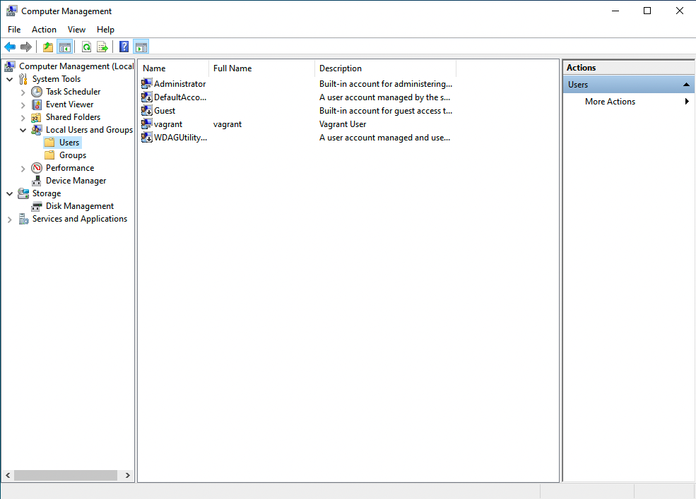
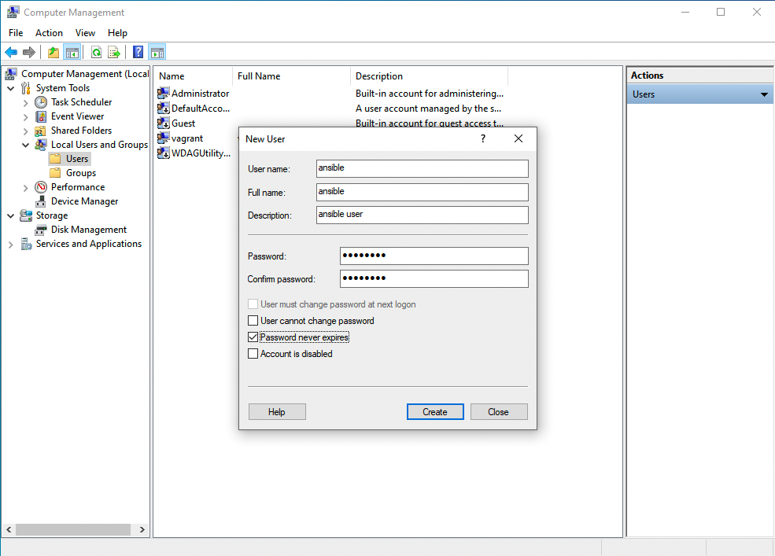
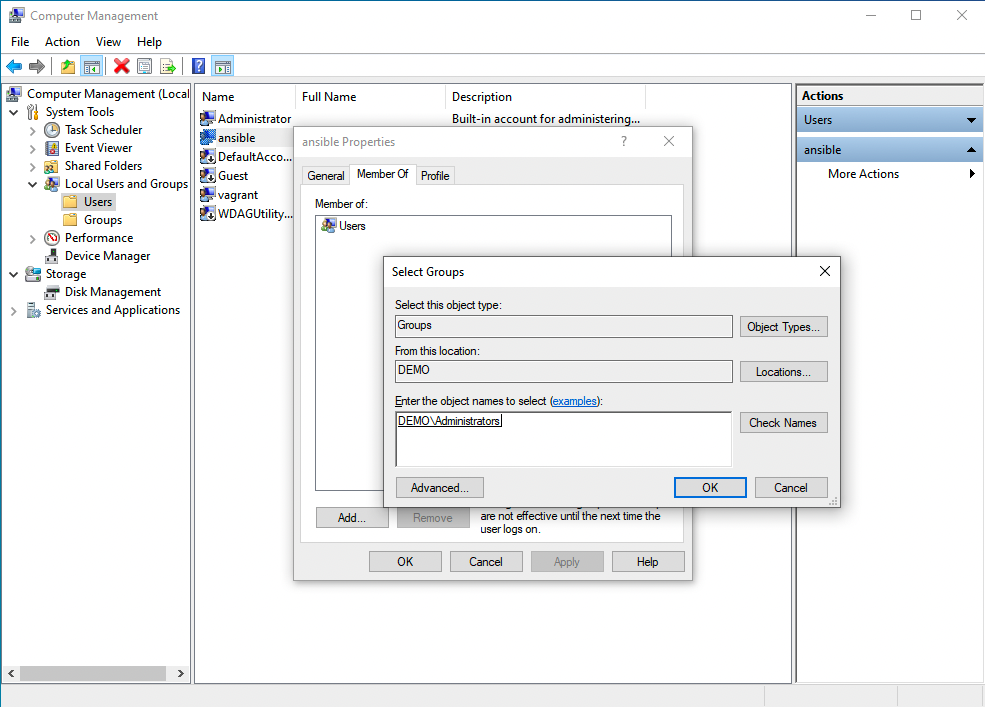

# How to configure a Windows Host for Ansible?
Steps to configure a “basic” authentication, use a Local/Administrator Accounts for authentication and successfully execute a simple “win_ping” Ansible Playbook. This initial configuration sometimes is a roadblock for some Windows users to start using Ansible. 

# Configure a Windows Host for Ansible
* Windows 7, 8.1, 10, 11
* Windows Server 2008, 2008 R2, 2012, 2012 R2, 2016, 2019, 2022
* PowerShell 3.0+ and .NET 4.0+
* WinRM or OpenSSH (experimental)
* The supported nodes include all the modern releases of Windows Desktop and Server. The full list includes Windows 7, 8.1, 10, 11, and Windows Server 2008, 2008 R2, 2012, 2012 R2, 2016, 2019, 2022. 
* Ansible requires PowerShell 3.0 or newer and at least .NET 4.0 to be installed on the Windows host. 
* You need to upgrade only old Windows 7 and Windows Server 2008 nodes. The communication between Ansible Controller and the target node is executed via a WinRM listener that needs to be created and activated. 
* Ansible 2.8 has added an experimental SSH connection for Windows-managed nodes for Windows 10+ clients and Windows Server 2019+. 

# Step below is going to cover the WinRM connection method with “basic” authentication. 

## **Links**
1. Setting up a Windows Host --> https://docs.ansible.com/ansible/latest/user_guide/windows_setup.html
2. Windows Remote Management --> https://docs.ansible.com/ansible/latest/user_guide/windows_winrm.html

# **Demo**

## **How to configure a Windows Host for Ansible connections.**

1. Create a user --> we can skip this if we wanna use build-in Administrator local account
2. verify PowerShell & .NET
3. setup WinRM
4. create Inventory & Playbook

### **NOTE: creating user step is only to be done if build-in Administrator account is not suppose to be used**
- First of all, I’d suggest creating a user to run Ansible automation. This user needs to be Power User or have Administrative privileges in order to execute some Ansible code. 

## Create an “ansible” user
1. Open Computer Management (right-click from “This PC” > “Manage”)
[](Readme.md)  

2. New User (right-click from “Users” > “New User”)
- User name: ansible 
- Full name: ansible 
- Description: ansible user 
- Password and Confirm password: Password123@ 
- Options: enable --> Password never expires and disable --> User must change password at next logon


3. Add “ansible” user to “administrators” Group



## Verify PowerShell, .NET and set up WinRM in the remote windows system
1. verify PowerShell version (execute command in powershell)
```powershell
PS C:\Users\achettri> Get-Host | Select-Object Version
Version
-------
5.1.19041.1237
```

2. Verify .NET version
```powershell
PS C:\Users\achettri> Get-ChildItem 'HKLM:\SOFTWARE\Microsoft\NET Framework Setup\NDP' -Recurse | Get-ItemProperty -Name version -EA 0 | Where { $_.PSChildName -Match '^(?!S)\p{L}'} | Select PSChildName, version
>>
PSChildName Version
----------- -------
Client      4.8.04084
Full        4.8.04084
Client      4.0.0.0
PS C:\Users\achettri>
```

3. Verify WinRM not-configured
```powershell
PS C:\Users\achettri> winrm get winrm/config/Service
WSManFault
    Message = The client cannot connect to the destination specified in the request. Verify that the service on the destination is running and is accepting requests. Consult the logs and documentation for the WS-Management service running on the destination, most commonly IIS or WinRM. If the destination is the WinRM service, run the following command on the destination to analyze and configure the WinRM service: "winrm quickconfig".
Error number:  -2144108526 0x80338012
The client cannot connect to the destination specified in the request. Verify that the service on the destination is running and is accepting requests. Consult the logs and documentation for the WS-Management service running on the destination, most commonly IIS or WinRM. If the destination is the WinRM service, run the following command on the destination to analyze and configure the WinRM service: "winrm quickconfig".
```
```powershell
PS C:\Users\achettri> winrm get winrm/config/Winrs
WSManFault
    Message = The client cannot connect to the destination specified in the request. Verify that the service on the destination is running and is accepting requests. Consult the logs and documentation for the WS-Management service running on the destination, most commonly IIS or WinRM. If the destination is the WinRM service, run the following command on the destination to analyze and configure the WinRM service: "winrm quickconfig".
Error number:  -2144108526 0x80338012
The client cannot connect to the destination specified in the request. Verify that the service on the destination is running and is accepting requests. Consult the logs and documentation for the WS-Management service running on the destination, most commonly IIS or WinRM. If the destination is the WinRM service, run the following command on the destination to analyze and configure the WinRM service: "winrm quickconfig".
```
```powershell
PS C:\Users\achettri> winrm enumerate winrm/config/Listener
WSManFault
    Message = The client cannot connect to the destination specified in the request. Verify that the service on the destination is running and is accepting requests. Consult the logs and documentation for the WS-Management service running on the destination, most commonly IIS or WinRM. If the destination is the WinRM service, run the following command on the destination to analyze and configure the WinRM service: "winrm quickconfig".
Error number:  -2144108526 0x80338012
The client cannot connect to the destination specified in the request. Verify that the service on the destination is running and is accepting requests. Consult the logs and documentation for the WS-Management service running on the destination, most commonly IIS or WinRM. If the destination is the WinRM service, run the following command on the destination to analyze and configure the WinRM service: "winrm quickconfig".
PS C:\Users\achettri>
```

4. Setup WinRM
```powershell
PS C:\Users\achettri> [Net.ServicePointManager]::SecurityProtocol = [Net.SecurityProtocolType]::Tls12
>> $url = "https://raw.githubusercontent.com/ansible/ansible/devel/examples/scripts/ConfigureRemotingForAnsible.ps1"
>> $file = "$env:temp\ConfigureRemotingForAnsible.ps1"
>>
>> (New-Object -TypeName System.Net.WebClient).DownloadFile($url, $file)
>>
>> powershell.exe -ExecutionPolicy ByPass -File $file
PS C:\Users\achettri>
```

5. Verify WinRM configured
```powershell
PS C:\Users\achettri> winrm get winrm/config/Service
Service
    RootSDDL = O:NSG:BAD:P(A;;GA;;;BA)(A;;GR;;;IU)S:P(AU;FA;GA;;;WD)(AU;SA;GXGW;;;WD)
    MaxConcurrentOperations = 4294967295
    MaxConcurrentOperationsPerUser = 1500
    EnumerationTimeoutms = 240000
    MaxConnections = 300
    MaxPacketRetrievalTimeSeconds = 120
    AllowUnencrypted = true
    Auth
        Basic = true
        Kerberos = true
        Negotiate = true
        Certificate = false
        CredSSP = false
        CbtHardeningLevel = Relaxed
    DefaultPorts
        HTTP = 5985
        HTTPS = 5986
    IPv4Filter = *
    IPv6Filter = *
    EnableCompatibilityHttpListener = false
    EnableCompatibilityHttpsListener = false
    CertificateThumbprint
    AllowRemoteAccess = true
```
```powershell
PS C:\Users\achettri> winrm get winrm/config/Winrs
Winrs
    AllowRemoteShellAccess = true
    IdleTimeout = 7200000
    MaxConcurrentUsers = 2147483647
    MaxShellRunTime = 2147483647
    MaxProcessesPerShell = 2147483647
    MaxMemoryPerShellMB = 2147483647
    MaxShellsPerUser = 2147483647
```
```powershell
PS C:\Users\achettri> winrm enumerate winrm/config/Listener
Listener
    Address = *
    Transport = HTTPS
    Port = 5986
    Hostname = WIN10
    Enabled = true
    URLPrefix = wsman
    CertificateThumbprint = F4D065F8FC6EE18F1F0FF9533584955D0C9B8E59
    ListeningOn = 10.0.2.15, 127.0.0.1, 169.254.20.54, ::1, fe80::44a1:482d:5918:7cb4%4, fe80::d017:a935:ff50:4eb4%5
```
```powershell
PS C:\Users\achettri> winrm enumerate winrm/config/Listener
Listener
    Address = *
    Transport = HTTPS
    Port = 5986
    Hostname = WIN10
    Enabled = true
    URLPrefix = wsman
    CertificateThumbprint = F4D065F8FC6EE18F1F0FF9533584955D0C9B8E59
    ListeningOn = 10.0.2.15, 127.0.0.1, 192.168.0.83, ::1, fe80::94b1:dc79:39cf:8b61%4, fe80::d017:a935:ff50:4eb4%5
PS C:\Users\achettri>
```
## Setup Ansible Controller
1. create any dir under your home dir
```bash
~ $ mkdir my_project
~ $ cd my_project
```

2. create the inventory file
```bash
my_project$ vim inventory

### add below lines
### My node name is win2019 but it can be anything for you
[windows]
win2019 ansible_host=192.168.4.100

[windows:vars]
ansible_user=<ansible/Administrator> # base on what you want to use
ansible_password=SuperSecurePassword123@
ansible_port=5986
ansible_connection=winrm
ansible_winrm_transport=basic
ansible_winrm_server_cert_validation=ignore
```

3. Create a test playbook for connection check
```bash
my_project$ vim ping.yml
```
```yml
---
- name: remote windows connection check
  hosts: windows
  become: false
  gather_facts: false
  tasks:
    - name: test connection
      win_ping:
```
4. Execute to check the connection
```bash
my_project$ ansible-playbook -i inventory ping.yml
PLAY [remote windows connection check] ***********************************************************************
TASK [test connection] ****************************************************************************
ok: [win2019]
PLAY RECAP ****************************************************************************************
win2019                  : ok=1    changed=0    unreachable=0    failed=0    skipped=0    rescued=0    ignored=0
```

### EIf you get output as above, Congrats and enjoy as you have successfully made connection with your windows node. Now you can start coding your playbook for the windows.
